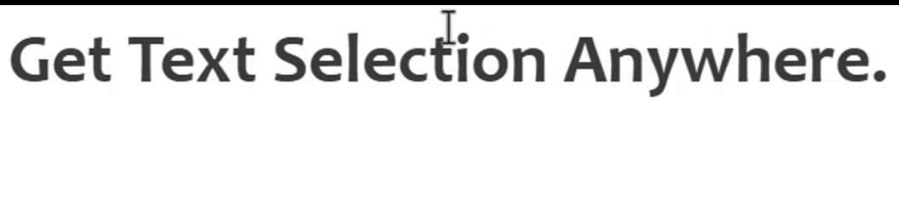

<div align="center">

```
┌─┐┌─┐┬  ┌─┐┌─┐┌┬┐┬┌─┐┌┐┌   ┬ ┬┌─┐┌─┐┬┌─
└─┐├┤ │  ├┤ │   │ ││ ││││───├─┤│ ││ │├┴┐
└─┘└─┘┴─┘└─┘└─┘ ┴ ┴└─┘┘└┘   ┴ ┴└─┘└─┘┴ ┴
```

<h1>selection-hook</h1>

<p><strong>The first full-featured, open-source cross-application text selection monitor.</strong></p>

[](https://www.npmjs.org/package/selection-hook)
[](LICENSE)


[English](README.md) · [中文](README.zh-CN.md)

</div>

<div align="center">

</div>

Detect when users select text in **any application** — and get the selected text, screen coordinates, and source program name **in real time**. Works across **Windows, macOS, and Linux** using native accessibility APIs that rarely touch the clipboard. Built as a native **Node.js/Electron** addon for production use.

## ✨ Key Features

- ⚡ **Real-time detection** — automatically captures text selections as they happen, no polling needed
- 📋 **Rich metadata** — selected text, screen coordinates, mouse positions, and source program name
- 🌍 **Cross-platform** — Windows, macOS, and Linux (X11 & Wayland) from a single API
- 🛡️ **Clipboard-friendly** — prioritizes native OS accessibility APIs; clipboard fallback is enabled by default as a last resort but rarely triggers, and can be disabled entirely
- 🖱️ **Input events** — mouse (`down`/`up`/`wheel`/`move`) and keyboard (`keydown`/`keyup`) events with full detail, no additional hooks required
- ⚙️ **Configurable** — clipboard fallback on/off, per-app filtering, passive mode, and more

## 💡 Use Cases

- 🤖 **AI assistants** — select text in any app to trigger AI actions, like [Cherry Studio](https://github.com/CherryHQ/cherry-studio)'s Selection Assistant or Doubao
- 💬 **Selection action tools** — popup actions on text selection, like PopClip
- 📖 **Dictionary / translation tools** — instant lookup on selection, like Eudic, GoldenDict, or Bob
- 📎 **Clipboard managers** — capture selections without polluting the clipboard, like Ditto or Paste
- ♿ **Accessibility tools** — read-aloud or magnify selected text
- 🛠️ **Developer tools** — inspect or transform selected content on the fly

Most similar tools only work on a single platform. selection-hook gives you one unified API across Windows, macOS, and Linux.

## 🖥️ Supported Platforms

| Platform | Status |
| -------- | ------ |
| Windows  | ✅ Fully supported (Windows 7+) |
| macOS    | ✅ Fully supported (macOS 10.14+) |
| Linux    | ✅ X11 — well supported<br>⚠️ Wayland — supported with limitations |

Linux has platform-level limitations compared to Windows/macOS due to the display server architecture. Wayland has additional limitations due to its restrictive security model. See [Linux Platform docs](docs/LINUX.md) for details.

## 🚀 Quick Start

### Install

Pre-built binaries included — no compilation required.

```bash
npm install selection-hook
```

### Basic Usage

```javascript
const SelectionHook = require("selection-hook");

const selectionHook = new SelectionHook();

// Listen for text selection events
selectionHook.on("text-selection", (data) => {
  console.log("Selected text:", data.text);
  console.log("Program:", data.programName);
  console.log("Coordinates:", data.endBottom);
});

// Start monitoring
selectionHook.start();

// Get the current selection on demand
const currentSelection = selectionHook.getCurrentSelection();
if (currentSelection) {
  console.log("Current selection:", currentSelection.text);
}

// Stop monitoring (can restart later)
selectionHook.stop();

// Clean up when done
selectionHook.cleanup();
```

### What You Get

The `text-selection` event emits an object like:

```json
{
  "text": "Hello, world!",
  "programName": "Google Chrome",
  "startTop": { "x": 100, "y": 200 },
  "startBottom": { "x": 100, "y": 220 },
  "endTop": { "x": 250, "y": 200 },
  "endBottom": { "x": 250, "y": 220 },
  "mousePosStart": { "x": 95, "y": 210 },
  "mousePosEnd": { "x": 255, "y": 210 },
  "method": 1,
  "posLevel": 3
}
```

See [`examples/node-demo.js`](https://github.com/0xfullex/selection-hook/blob/main/examples/node-demo.js) for detailed usage.

## 🔧 How It Works

| Platform | Primary Method | Fallback |
| -------- | -------------- | -------- |
| Windows  | UI Automation, Accessibility API | Simulated `Ctrl+C` |
| macOS    | Accessibility API (AXAPI) | Simulated `⌘+C` |
| Linux    | PRIMARY selection (X11/Wayland) | — |

Selection Hook uses native OS accessibility APIs to read selected text directly from the focused application — no polling required. The clipboard fallback is enabled by default but only kicks in as a last resort when accessibility APIs can't retrieve the text, so in the vast majority of cases the clipboard remains untouched. If you need to guarantee zero clipboard interference, you can disable the fallback entirely via `disableClipboard()` or `{ enableClipboard: false }` in the start config.

## 📚 API Reference

For full API documentation — methods, events, data structures, and constants — see [docs/API.md](docs/API.md).

## 🏗️ Building from Source

Pre-built binaries ship with npm — build only if you are modifying the native code.

- `npm run rebuild` — build for your current platform
- `npm run prebuild` — build for all supported platforms
- `npm run demo` — run the demo

<details>
<summary>Linux build dependencies</summary>

```bash
# Ubuntu/Debian
sudo apt install libevdev-dev libxtst-dev libx11-dev libxfixes-dev libwayland-dev

# Fedora
sudo dnf install libevdev-devel libXtst-devel libX11-devel libXfixes-devel wayland-devel

# Arch
sudo pacman -S libevdev libxtst libx11 libxfixes wayland
```

The Wayland protocol C bindings are pre-generated and committed — see [`src/linux/protocols/wayland/README.md`](src/linux/protocols/wayland/README.md) for details.

</details>

<details>
<summary>Python setuptools</summary>

If you encounter `ModuleNotFoundError: No module named 'distutils'` during build, install the required Python package:

```bash
pip install setuptools
```

</details>

<details>
<summary>Electron notes</summary>

**electron-builder**: Electron will forcibly rebuild Node packages during packaging. You may need to run `npm install` in `./node_modules/selection-hook` beforehand to ensure necessary packages are downloaded.

**electron-forge**: Add these values to your config to avoid unnecessary rebuilding:

```javascript
rebuildConfig: {
    onlyModules: [],
},
```

</details>

### Compatibility

- Node.js 12.22+ | Electron 14+
- TypeScript support included

## 💎 Used By

This project is used by:

- **[Cherry Studio](https://github.com/CherryHQ/cherry-studio)** — A full-featured AI client, with Selection Assistant that conveniently enables AI-powered translation, explanation, summarization, and more for selected text. _(This library was originally developed for Cherry Studio, which showcases best practices for usage.)_

Using selection-hook in your project? [Let us know!](https://github.com/0xfullex/selection-hook/issues)

## 📄 License

[MIT](LICENSE)
